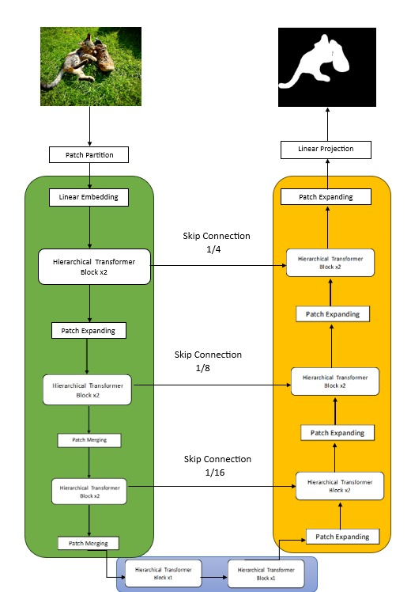

# Hierarchical Transformer Encoder with U-Net for Image Segmentation

## Overview

This project implements a **Hierarchical Transformer Encoder** combined with **U-Net** for semantic image segmentation. The model is designed to leverage the attention mechanisms of transformers and the spatial context captured by the U-Net architecture, providing enhanced segmentation accuracy for a variety of image data.



> *Figure 1: Model Architecture of the Hierarchical Transformer Encoder with U-Net*

## Table of Contents
- [Overview](#overview)
- [Model Architecture](#model-architecture)
- [Installation](#installation)
- [Usage](#usage)
- [Training Your Own Model](#training-your-own-model)
- [License](#license)

## Model Architecture

The architecture consists of two main components:

1. **Hierarchical Transformer Encoder**:
   - Extracts multi-scale features from input images, capturing long-range dependencies.
   - Performs hierarchical feature fusion at multiple scales.

2. **U-Net Decoder**:
   - Uses upsampling and skip connections to restore spatial information and generate segmentation maps.

The combination of these two approaches enables the model to achieve high accuracy in image segmentation tasks by capturing both local and global image features.

## Installation

### Prerequisites
Ensure you have the following dependencies installed:

- Python 3.8+
- PyTorch 1.8+
- torchvision
- Flask
- PIL (Python Imaging Library)

You can install the required libraries by running:

```bash
pip install -r requirements.txt
